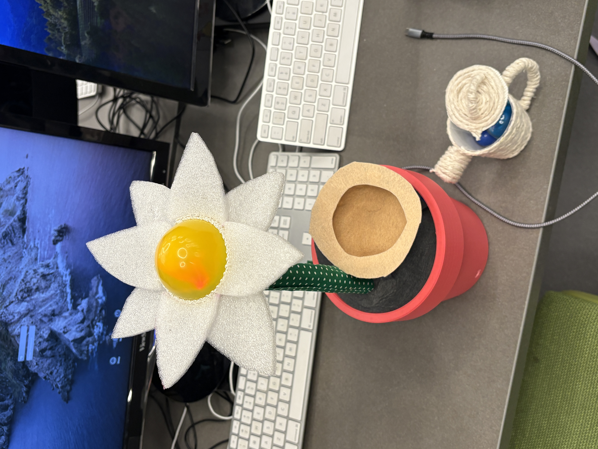

# myMagnolia ✿
[Project Website](https://mymagnolia.cargo.site/)
## Description

A **Tangible User Interface** Project by Johanna, Nina, Esther

**Problem Statement**: 

How might we design a novel tangible user interface, which helps support the productivity, creativity, and well being of people who work or study in mobile environments?

**Our Product**:
`MyMagnolia` is a flower-shaped TUI that provides **multisensory feedback** to help users manage stress in a remote work environment.
In a time where we rely on our screens, MyMagnolia supports users to pause with meditative sounds, calming light features, and serves as a floral friend.




**Intended Users**:
- [x] a college student taking a virtual course
- [x] an accounting professional working from home
- [x] all users who work from remote locations benefit from MyMagnolia.

## Tools used

- Arduino Uno
- [Load Cell](https://www.amazon.com/WWZMDiB-Amplifier-HX711-Displacement-Acceleration/dp/B0BLNR4S1P/ref=sr_1_3?crid=34IYA27Z8D683&dib=eyJ2IjoiMSJ9.CMkp0W1bNn-5AwaIVUuJJQlM_YH2GmYPTIfzaZrSzP5LIDK4np4qHfcsXtwo0LWOYySeC9q_0oW-vuorSs1xEVPaFFPGG7bc6hSXRyMq6DtpRN2bRqqahp-T8KWvC_vUsDJZk3z_LeiLcLZRS8kESvHRXSTD3rRMf1yZYJIJ89-HZ5vpINO7CT-j1L4PlAW7Yx-5S3b9Vm-G9NfJodJcc0pRjXbKJk4oRESNqaA3JFQhPg2hkhQsTVoMohUBghshg04CYpbQ201Dzm0WDT9DuOWf63ufDN2PjAnMNJoAKPE.QSejasGaSnWXcIhr_Qkkw0jqjl4r2FRPCT__ZcRF33c&dib_tag=se&keywords=load%2Bcell&qid=1745865337&s=industrial&sprefix=load%2Bcell%2Cindustrial%2C117&sr=1-3&th=1)
- [Load Cell Frame](https://www.thingiverse.com/thing:4602226)
- [DFPlayerMini](https://www.amazon.com/WWZMDiB-YX5200-DFPlayer-Supporting-Arduino/dp/B0CH2WZT5Q/ref=sr_1_1_sspa?dib=eyJ2IjoiMSJ9.IeILjxJzk-x5hYGixHiDKgagpvMhkx3D16_leA3Bo_KagOpNQNE8h1OrjvYZ-qjLvSMbTprhdTp35-nUUCwIo_iRwe_FF7-u5c9BdLrSQF9knbLkETSHI20CXm3gtG1E4pTAWXLXvhB3IgKW2vtTFZNLSjZn5MYW9RfwFDAmbOXo-11ZsTGu0x5Es21tsmV1fwCF3qBtEPNIn2NNuahfexlw6uWtcmT2Zgtf5su1ToU.Lo3xKDnDEGrAO8PVuP6LM6vYI1g9sARcMwBJasi0zQE&dib_tag=se&keywords=df+player+mini&qid=1745865457&sr=8-1-spons&sp_csd=d2lkZ2V0TmFtZT1zcF9hdGY&psc=1)
- [3D printed pot](https://www.thingiverse.com/thing:6782495)
- Speaker, LED
- In `/Arduino`:
    - Load Cell calibration: `Calibration_copy_20250419165240`
    - Libraries: `DFRobotDFPlayerMini` for DFPlayerMini, `HX711_ADC` for Load cell
    - Main file to run: `sketch_myMagnolia`


## Setup
Follow these two tutorials:
- clone this repository, use the files in `/Arduino`.
- [Load Sensor Tutorial](https://www.youtube.com/watch?v=sxzoAGf1kOo&ab_channel=Indrek)
- [DFPlayerMini](https://circuitjournal.com/how-to-use-the-dfplayer-mini-mp3-module-with-an-arduino)
- Use a breadboard so you have enough space to connect to 5v/ground. 
- Modify the main file `sketch_myMagnolia` for your project, especially this part:
```
// ——— THRESHOLDS & STATE ————————————
const float thresholds[] = {3.0, 10.0, 40.0, 100.0};  // cut‑offs, adjust as needed
const int tracks[]  = {1, 2, 3, 4};  // DFPlayer track numbers
```


## Troubleshooting
Q: I keep seeing `DFPlayer init failed! Check wiring/power/SD card.`


A: This happens if the wire disconnected from the breadboard. Check wires. Also make sure the SD card is in the DFPlayer mini.

Q: I put the tracks in the SD card but it's not playing. 


A: So the DFPlayer is a very basic player, so you need to follow the exact steps:
- Duplicate the mp3 files in order you want to play
- Name those in order `0001.mp3`, `0002.mp3`, and so on. It needs to be this exact name. 
- Put all the files in the folder `mp3`. This is because we're using function ` dfPlayer.playMp3Folder(pendingTrack);` 

Q: The weight values are so off


A:
- Make sure you soldered the load cell wires!!! If you don't do this, the weight values will just like crazy. Watch the youtube video linked below for detailed steps.
- You will have to recalibrate. Use the sketch `Calibration_copy_20250419165240`. You can just run it and follow the steps that show up on the serial monitor. I got the file from the github linked in this [youtube video](https://www.youtube.com/watch?v=sxzoAGf1kOo&ab_channel=Indrek). Highly recommend watching the video if you are having trouble with the load cell.

Q: The DFPlayermini works for one song, stops working, then starts again, ... / a lot of noise with the music


A: Do you have a voltage dividor for the DFPlayermini?? DFPlayermini's operating voltage is 3.3V, so since we're using 5v you need a voltage divider.

## Usage
1. Connect Arduino uno to power source and upload sketch_myMagnolia to it. 
2. On the Serial Montior, you should see:
```
Starting...
HX711 Ready
Initializing DFPlayer…
```
and then the weight value starts loading.
3. When you place marbles(or other objects) on the weight sensor, you should see the weight values on the serial monitor.
4. If you pass certain thresholds, the DFPlayerMini will play certain tracks.
## Credits
- Our Team: Johanna, Nina, Esther
- Wellesley HCI Lab 🤍
- [Load Sensor Tutorial](https://www.youtube.com/watch?v=sxzoAGf1kOo&ab_channel=Indrek)
- [DFPlayerMini](https://circuitjournal.com/how-to-use-the-dfplayer-mini-mp3-module-with-an-arduino)
- [DFPlayerMini Video Tutorial](https://www.youtube.com/watch?v=P42ICrgAtS4&ab_channel=Indrek)


